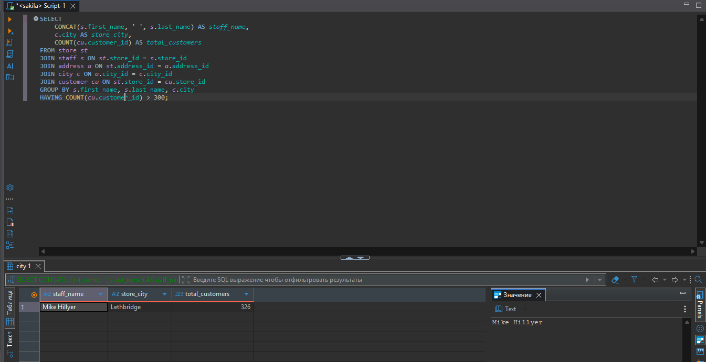
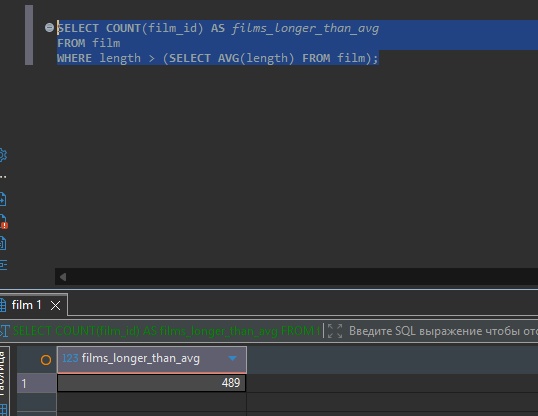
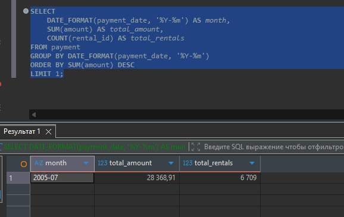
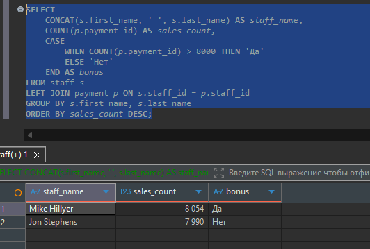
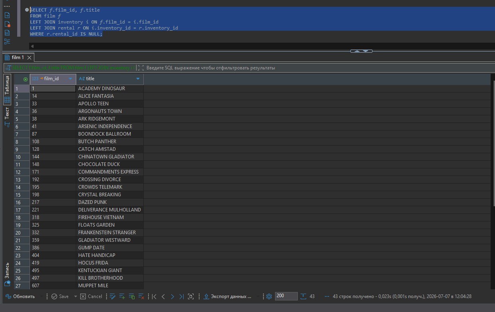

# Домашнее задание к занятию «SQL. Часть 2»

---

### Задание 1
Одним запросом получите информацию о магазине, в котором обслуживается более 300 покупателей, и выведите в результат следующую информацию:

- фамилия и имя сотрудника из этого магазина;
- город нахождения магазина;
- количество пользователей, закреплённых в этом магазине.

---

### Задание 2

Получите количество фильмов, продолжительность которых больше средней продолжительности всех фильмов.

---

### Задание 3

Получите информацию, за какой месяц была получена наибольшая сумма платежей, и добавьте информацию по количеству аренд за этот месяц.

---

### Дополнительные задания (со звёздочкой*)

Эти задания дополнительные, то есть не обязательные к выполнению, и никак не повлияют на получение вами зачёта по этому домашнему заданию. Вы можете их выполнить, если хотите глубже шире разобраться в материале.

---

### Задание 4*

Посчитайте количество продаж, выполненных каждым продавцом. Добавьте вычисляемую колонку «Премия». Если количество продаж превышает 8000, то значение в колонке будет «Да», иначе должно быть значение «Нет».

---

### Задание 5*

Найдите фильмы, которые ни разу не брали в аренду.

---

<h2 align="center">Решение</h2>

---

### Задание 1

Получить информацию о магазине, в котором обслуживается более 300 покупателей.


```sql
SELECT 
    CONCAT(s.first_name, ' ', s.last_name) AS staff_name,
    c.city AS store_city,
    COUNT(cu.customer_id) AS total_customers
FROM store st
JOIN staff s ON st.store_id = s.store_id
JOIN address a ON st.address_id = a.address_id
JOIN city c ON a.city_id = c.city_id
JOIN customer cu ON st.store_id = cu.store_id
GROUP BY s.first_name, s.last_name, c.city
HAVING COUNT(cu.customer_id) > 300;

```

Результат:



---

### Задание 2

Получить количество фильмов, продолжительность которых больше средней продолжительности всех фильмов.

```sql
SELECT COUNT(film_id) AS films_longer_than_avg
FROM film
WHERE length > (SELECT AVG(length) FROM film);
```

Результат:



---

### Задание 3

Получить информацию о месяце с наибольшей суммой платежей и количестве аренд за этот месяц.

```sql
SELECT 
    DATE_FORMAT(payment_date, '%Y-%m') AS month,
    SUM(amount) AS total_amount,
    COUNT(rental_id) AS total_rentals
FROM payment
GROUP BY DATE_FORMAT(payment_date, '%Y-%m')
ORDER BY SUM(amount) DESC
LIMIT 1;
```

Результат:



---

### Задание 4*

Посчитать количество продаж у каждого продавца и добавить колонку «Премия» (Да, если продаж > 8000).

```sql
SELECT 
    CONCAT(s.first_name, ' ', s.last_name) AS staff_name,
    COUNT(p.payment_id) AS sales_count,
    CASE 
        WHEN COUNT(p.payment_id) > 8000 THEN 'Да'
        ELSE 'Нет'
    END AS bonus
FROM staff s
LEFT JOIN payment p ON s.staff_id = p.staff_id
GROUP BY s.first_name, s.last_name
ORDER BY sales_count DESC;
```

Результат:



---

### Задание 5*

Найти фильмы, которые ни разу не брали в аренду.

```sql
SELECT f.film_id, f.title
FROM film f
LEFT JOIN inventory i ON f.film_id = i.film_id
LEFT JOIN rental r ON i.inventory_id = r.inventory_id
WHERE r.rental_id IS NULL;
```

Результат:



---
